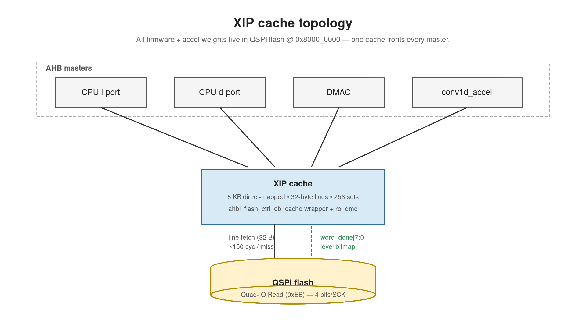
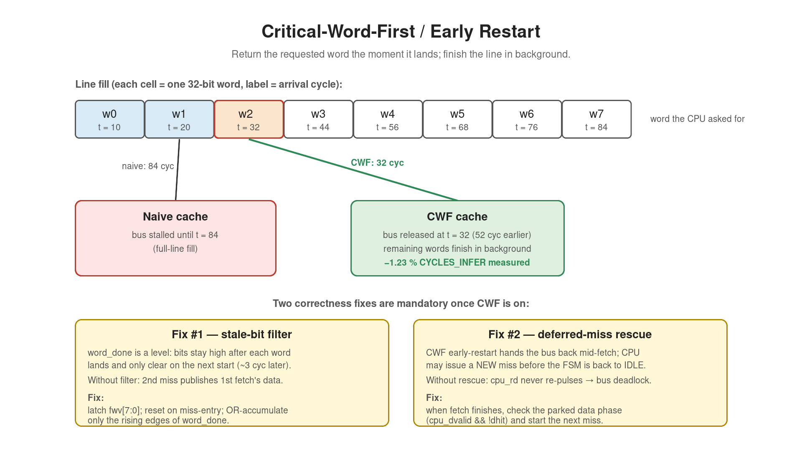
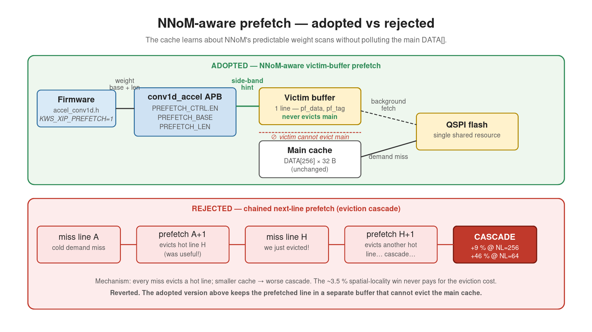

# XIP cache — three slides

To regenerate: `make -C docs/slides`.

---

## Slide 1 — Why we have a cache, and what it looks like

* All firmware (and accelerator weights) live in QSPI flash at  `0x8000_0000`. 
  Without a cache, every CPU instruction fetch and every accel weight read pays the full QSPI miss penalty
  (~150 cycles per 32-byte line).
* **Four AHB masters** funnel into one read-only direct-mapped cache:
  CPU instruction port, CPU data port, DMAC, conv1d_accel.
* Cache spec: **8 KB total** (256 lines × 32-byte line) + tag/valid bits.
* Flash side runs **Quad-IO Read (0xEB)** — 4 bits per SCK edge,
  giving the cache 4× the throughput of plain SPI on every miss.
* Flash also reports a **per-word ready bitmap** (`word_done[7:0]`)
  back to the cache: bit K goes high the moment word K (= bytes
  4K..4K+3) lands.  This bitmap is what makes the next slide
  possible.

---

## Slide 2 — The win: Critical-Word-First / Early Restart

* A miss fetches a 32-byte (8-word) line.  But the CPU only asked
  for *one* word.  Why wait for the other seven?
* **CWF**: watch the per-word bitmap.  The instant the requested
  word lands (here w2 at t=32, vs the full-line t=84), release
  `HREADYOUT` to the CPU.  Remaining words fill in the background.
* Two correctness fixes are mandatory once CWF is on:
  * **Stale-bit filter** — `word_done` is *level*, not edge; bits
    stay high after each word lands and only clear on the next
    `start`.  We latch our own `fwv[7:0]` that resets on miss-entry
    and OR-accumulates only the rising edges, otherwise the second
    miss publishes data from the previous fetch.
  * **Deferred-miss rescue** — CWF lets the CPU issue a NEW miss
    while the first fetch is still finishing; without rescue logic
    the FSM is busy, the new request can't get queued, and the bus
    deadlocks.  We catch the parked data phase and use it as the
    next miss when the current fetch wraps up.
* **Measured**: −1.23 % CYCLES_INFER on `mel_compact_4blk_ch36`;
  −34 % stall on the standalone TB across non-zero word offsets.

---

## Slide 3 — Adopted vs rejected: NNoM-aware victim-buffer prefetch

* **Rejected: chained next-line prefetch.** On every demand miss, 
  also prefetch line+1 into the main cache. TB passed 54/54.  But 
  end-to-end every cache size regressed: +9 % CYCLES_INFER at 
  NL=256, +46 % at NL=64, never finishes at NL=32. Mechanism: 
  prefetch evicts a hot line on every miss → CPU misses on the 
  evicted line → triggers another prefetch → eviction cascade. 
  Smaller cache, worse cascade.
* **Adopted (gated, default OFF): NNoM-aware prefetch.**  The
  firmware on this SoC always runs NNoM.  Each Conv2D call's weight
  scan is strictly sequential and the accelerator knows the start
  address + length the moment it starts.
* Three new APB regs on `conv1d_accel`: `PREFETCH_BASE`,
  `PREFETCH_LEN`, `PREFETCH_CTRL.EN`.  When the firmware pulses EN,
  a side-band into `ro_dmc` triggers a fetch into a **separate
  single-line victim buffer** — never evicts main-cache lines, so
  the cascade above is structurally impossible.
* MVP fetches first line per call: −1.29 % CYCLES_INFER. Multi-
  82 +  line walk over `[BASE, BASE+LEN)` is the next refinement.

